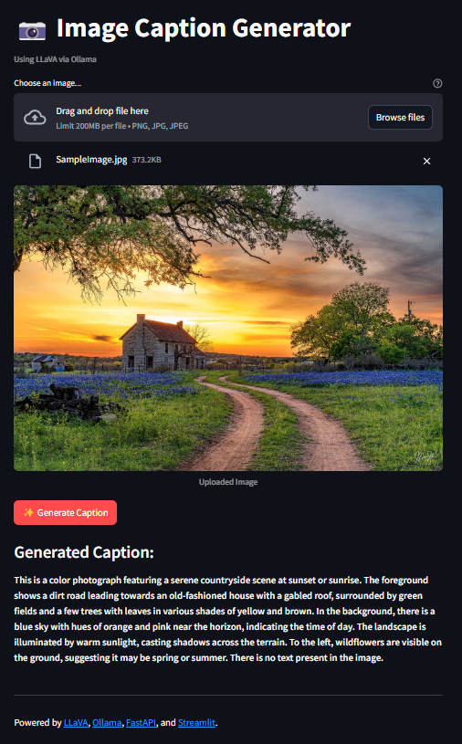

# Image Caption Generator using LLaVA via Ollama

[](https://opensource.org/licenses/MIT)

## Overview

This project demonstrates how to build a simple web application that generates descriptive captions for uploaded images. It utilizes the powerful **LLaVA (Large Language and Vision Assistant)** multimodal model, accessed locally through **Ollama**. The application features a **FastAPI** backend to handle image processing and communication with Ollama, and a user-friendly **Streamlit** frontend for image uploads and caption display.

## Features

*   **Image Captioning**: Leverages the LLaVA model to generate relevant captions for images.
*   **Local Model Execution**: Uses Ollama to run the LLaVA model locally, ensuring privacy and control.
*   **Web Interface**: Provides an easy-to-use interface built with Streamlit for uploading images and viewing results.
*   **RESTful API**: Exposes a FastAPI endpoint for caption generation, allowing potential integration with other services.

## Prerequisites

*   **Python**: Version 3.8 or higher.
*   **Ollama**: Installed and running. Follow the instructions on [https://ollama.com/](https://ollama.com/) to install Ollama for your operating system.
*   **LLaVA Model**: Pulled via Ollama. Open your terminal and run:
    ```bash
    ollama pull llava
    ```

## Setup and Installation

1.  **Clone the Repository:**
    Clone this repository to your local machine:
    ```bash
    git clone https://github.com/ashish-kj/ImageCaptionGenerator.git
    cd ImageCaptionGenerator
    ```

2.  **Create Project Directories (if not cloned):**
    If you didn't clone, create the necessary directories manually:
    ```bash
    # mkdir ImageCaptionGenerator # Assuming you are already in a parent directory
    # cd ImageCaptionGenerator
    mkdir backend frontend
    touch backend/main.py frontend/app.py README.md requirements.txt .gitignore
    ```

3.  **Create a Virtual Environment:**
    It's recommended to use a virtual environment to manage dependencies.
    ```bash
    python -m venv venv
    ```
    Activate the environment:
    *   **Windows:** `.\venv\Scripts\activate`
    *   **macOS/Linux:** `source venv/bin/activate`

4.  **Install Dependencies:**
    Install the required Python packages listed in `requirements.txt`. *(Note: We will create/update `requirements.txt` later)*
    ```bash
    pip install -r requirements.txt
    ```


## Project Structure

```
image-caption-llava/
├── .venv/               # Virtual environment directory (if created)
├── backend/
│   └── main.py        # FastAPI application
├── frontend/
│   └── app.py         # Streamlit application
├── requirements.txt     # Project dependencies
├── .gitignore           # Files/directories ignored by Git
└── README.md          # This file
```

## Running the Application

You need to run the backend and frontend servers separately, typically in two different terminal windows/tabs. **Make sure Ollama is running** before starting the backend.

1.  **Start the Backend (FastAPI):**
    Navigate to the project root directory (`image-caption-llava/`) in your terminal (with the virtual environment activated).
    ```bash
    uvicorn backend.main:app --reload --port 8000
    ```
    The backend API will be available at `http://localhost:8000`.

2.  **Start the Frontend (Streamlit):**
    Open a *new* terminal window/tab, navigate to the project root directory, and activate the virtual environment if necessary.
    ```bash
    streamlit run frontend/app.py
    ```
    The Streamlit application will open automatically in your web browser, usually at `http://localhost:8501`.

## Usage

1.  Open the Streamlit application in your browser (`http://localhost:8501`).
2.  Click "Browse files" to upload an image (PNG, JPG, JPEG).
3.  The uploaded image will be displayed.
4.  Click the "✨ Generate Caption" button.
5.  The backend will process the image with LLaVA via Ollama, and the generated caption will appear below the button.

## Demo




## Further Improvements / TODO

*   Add more sophisticated error handling and user feedback.
*   Allow users to select different Ollama models if available (e.g., via dropdown).
*   Implement asynchronous processing on the backend for potentially long caption generation times.
*   Add unit and integration tests for backend and frontend components.
*   Containerize the application using Docker for easier deployment.
*   Improve UI/UX (e.g., loading indicators, image previews).
*   Add configuration options (e.g., Ollama URL, model name via environment variables).

## License

This project is licensed under the MIT License - see the [LICENSE](LICENSE) file for details.
